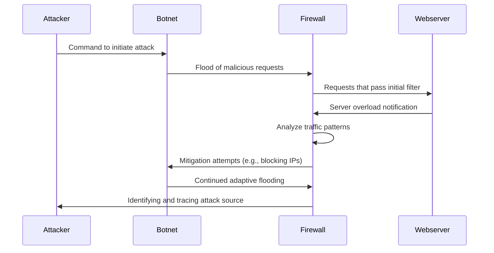

1. **Command to initiate attack:**
   - The Attacker sends commands to the Botnet, a network of compromised systems, instructing them to begin the DDoS attack.
   - The Attacker coordinates the attack and defines the target, ensuring the attack is synchronized for maximum impact.

2. **Flood of malicious requests:**
   - The Botnet, consisting of many infected devices, sends a flood of requests to the Firewall.
   - These requests are designed to overwhelm the server, consuming its resources and causing legitimate traffic to be denied service.

3. **Requests that pass initial filter:**
   - The Firewall, acting as the first line of defense, filters incoming traffic to identify and block malicious patterns.
   - Some requests may bypass the initial filtering, reaching the Webserver.

4. **Server overload notification:**
   - The Webserver detects that it is being overwhelmed and sends a notification to the Firewall.
   - This feedback helps the Firewall refine its defense mechanisms.

5. **Analyze traffic patterns:**
   - The Firewall analyzes traffic patterns to identify unusual behaviors, such as excessive requests from specific IP addresses or regions.
   - This step helps in dynamically updating filtering rules.

6. **Mitigation attempts (e.g., blocking IPs):**
   - Based on the analysis, the Firewall blocks IPs associated with malicious traffic or applies rate limiting.
   - These actions aim to reduce the attack's impact and restore normal operation.

7. **Continued adaptive flooding:**
   - The Botnet adapts to the defensive measures by changing attack vectors, such as varying IP addresses or request patterns.
   - This ongoing battle tests the Firewall's adaptability.

8. **Identifying and tracing attack source:**
   - The Firewall attempts to trace the source of the attack, identifying command-and-control servers or the Attacker.
   - This information can be used for legal actions or to further strengthen defenses.