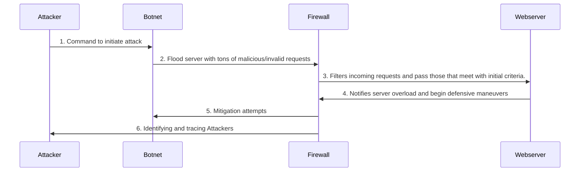

Before we explain the diagram, let's define our players.

Attacker - Botnet Operator

Botnet - a network of private computers infected with malicious softwares and controlled without the owner's knowledge.

Firewall - a part of a computer system or network which is designed to block unauthorized access while permitting outward communication

Webserver - a computer system that hosts websites and delivers web content to users

1. Command to initiate attack:
   - The Attacker sends commands to the Botnet, telling them to begin the DDoS attack. The attack is coordinated for maximum damage and effectiveness.

2. Flood of malicious requests:
   - The Botnet sends a huge amount of requests to the Firewall, aiming to overload the Webserver and consuming its resources, causing valid or legitimate traffic to be denied. Hence the name, distributed denial-of-service.
   

3. Requests that pass initial filter:
   - The Firewall, acting as the first line of defense, filters incoming traffic to identify and block malicious patterns. However, since there are so many, a lot requests may bypass the initial filtering and reach the Webserver.

4. Server overload:
   - The Webserver detects that it is being overwhelmed and sends a notification to the Firewall.

5. Mitigation attempts (e.g., blocking IPs):
   - Depending on the mitigation strategies, the firewall will beging to block IPs, access control lists, traffic analysis and monitoring, etc... These actions aim to reduce the attack's impact and restore normal operation.

6. Identifying and tracing attack source:
   - The Firewall attempts to trace the source of the attack, identifying the Attacker and collect information on the Attacker.