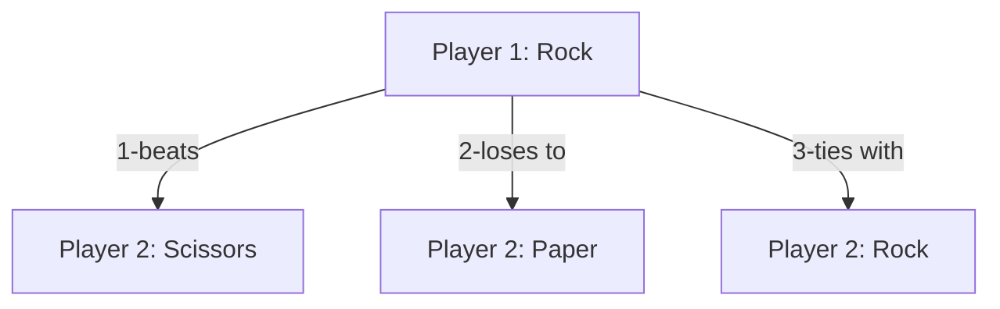

Explanation of Diagram:

This is a diagram explaining the different scenarios for Rock, Paper and Scissor. 

1. Player 1 chooses Rock. Player 2 chooses scissors. Thus, player 1 wins since rock beats scissor. 

2. Player 1 chooses Rock. Player 2 chooses Paper. Thus, player 1 loses since paper beats rock. 

3. Player 1 chooses Rock. Player 2 chooses Rock, which ends in a tie. 

So basically, I want to make a freelancer marketplace for online gaming. I want to follow the model similar to that of fiverr and upwork, where people posts what kind of services they would like and what they are willing to pay for it. It could be anything from lvling services, playing games with them or earning silvers or coins for example. The platform will be the middleman. There are 2 types of users that we need to account for, we will call them Posters and Laborers
-	Posters – the ones making a post and hiring people. These are the paying users we need to focus on attracting. 
-	Laborers – workers, the ones who will be doing the work. 
There is a similar website out there called Epals, but I find that its main attractions are for girls e gamers. It’s basically a way for girls to make money, playing games with other people. 
