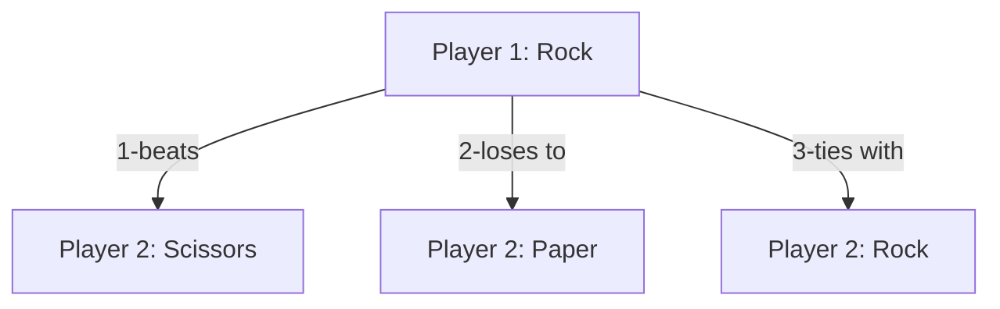

Explanation of Diagram:

This is a diagram explaining the different scenarios for Rock, Paper and Scissor. 

1. Player 1 chooses Rock. Player 2 chooses scissors. Thus, player 1 wins since rock beats scissor. 

2. Player 1 chooses Rock. Player 2 chooses Paper. Thus, player 1 loses since paper beats rock. 

3. Player 1 chooses Rock. Player 2 chooses Rock, which ends in a tie. 