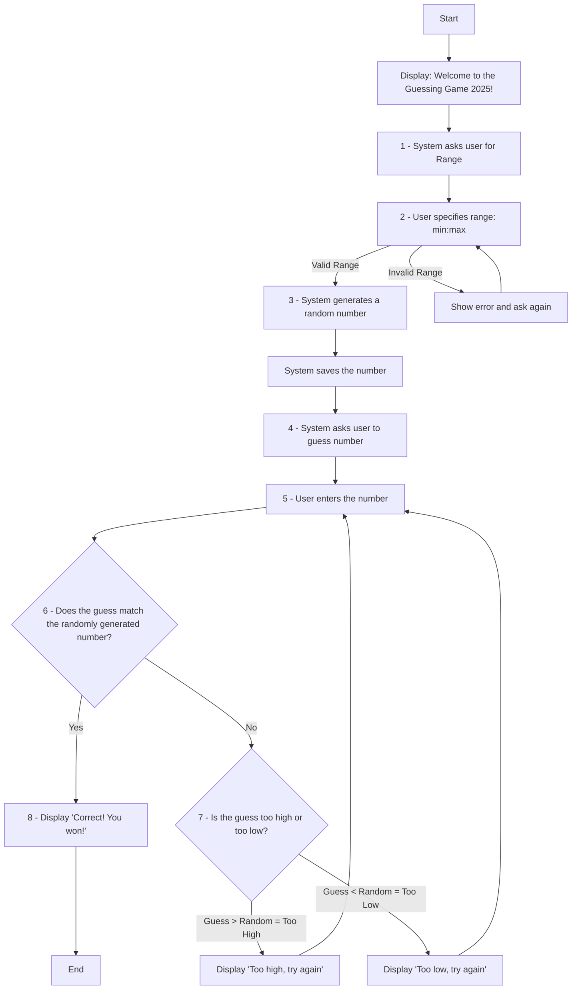

In this diagram, we are implementation a guessing game with the user. Here are the steps,

1. The system asks the user for indicate a range, i.e  1:100, 1:10000
2. The user specifies the range and the system determines if it's a valid range or not, i.e 10:1 is not a valid range, 5:100 is a valid range
3. The system will then generate a random number and saves it
4. System will then ask the users to guess the number
5. User will enter a number, i.e 10
6. System will determine if the number is correct.
7. If the number is incorrect, the system then determine if the guess is lower or higher than the number. If the guess is higher than the number, then it will display too high. If the guess is lower than the number, then it will display too low.
8. If the guess is correct, then the game is over and the user wins. 
