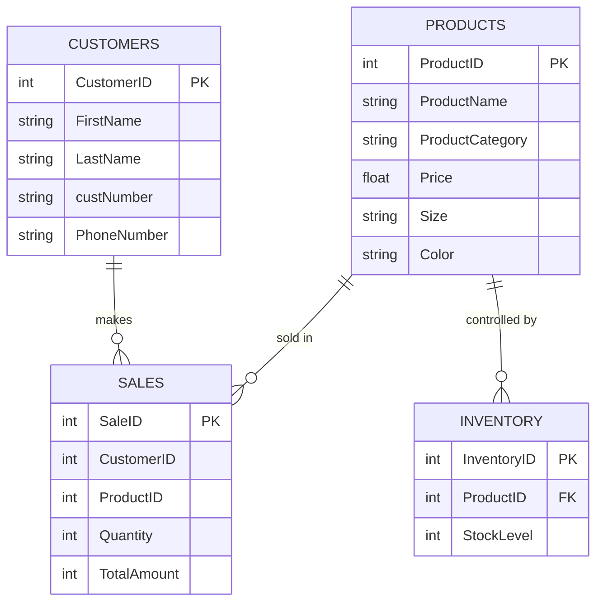

NikeStore_ERD.md

# Nike Store  ERD

### Description of Entities

1. Products:
   - Captures details about the shoes available for sale, including unique identifiers, product details, pricing, size and color. 

2. Customers:
   - Stores customer information, enabling the tracking of sales and customer-specific transactions.

3. Sales:
   - Records each transaction, linking customers to products, including the quantity sold and the total amount of the sale.

4. Inventory:
   - Manages stock levels of each product

### Relationships:

1. Products to Sales:
   - A product can be sold in multiple sales, and each sale can include multiple products.

2. Customers to Sales:
   - A customer can make multiple purchases, and each sale is linked to a single customer.

3. Products to Inventory:
   - Products are tracked in inventory.

